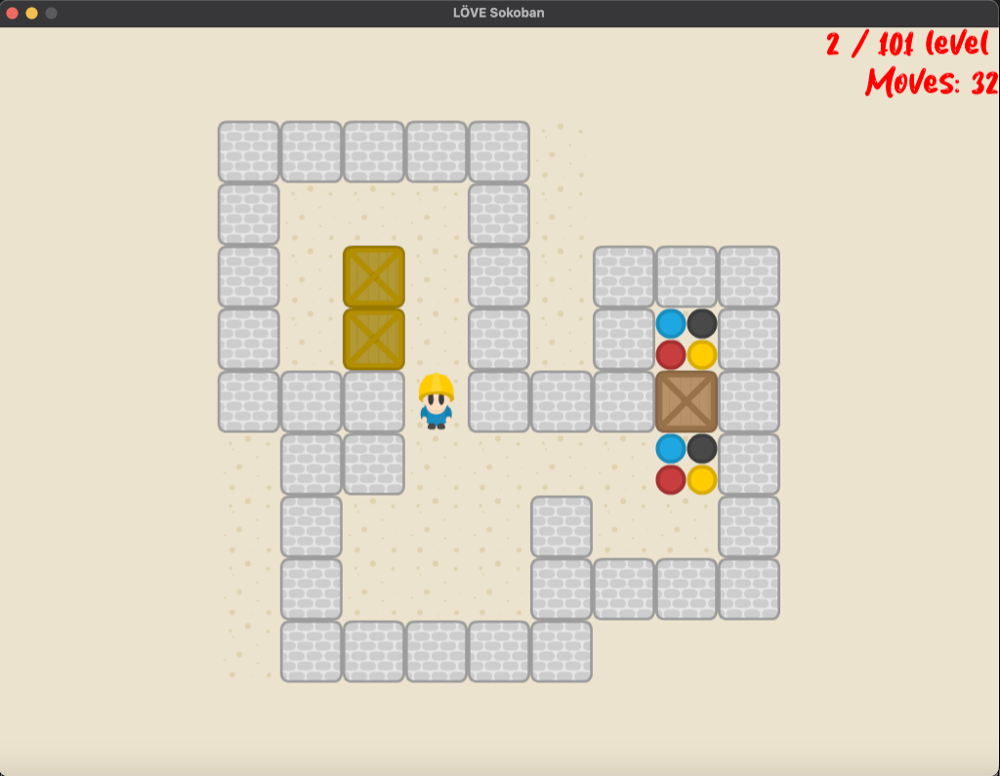

# LÖVE Sokoban

This project is a clone of the classic Sokoban game, written using the LÖVE 2D framework. Sokoban is a type of transport puzzle, in which the player pushes boxes or crates around in a warehouse, trying to get them to storage locations. This clone aims to replicate the original gameplay and provide a similar experience, leveraging the capabilities of the LÖVE 2D framework.

## Screenshots

## Addons
* [Love2D](https://love2d.org) - website of LÖVE.
* [berbasoft.com](https://berbasoft.com/simplegametutorials/love/sokoban/) - website I based on and took levels from
* [opengameart](https://opengameart.org/content/sokoban-pack) - spritesheet
* [opengameart](https://opengameart.org/content/coin-sound-effect-harmonica) - next lvl sfx
* [opengameart](https://opengameart.org/content/plingy-coin) - move box sfx
* [opengameart](https://opengameart.org/content/puzzle-reflexion-loop-opening-theme) - music
* [youtube](https://youtu.be/ddBqasyJIWQ) - gameplay
